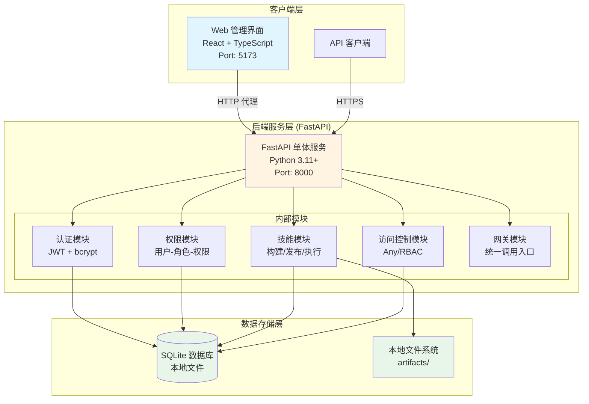
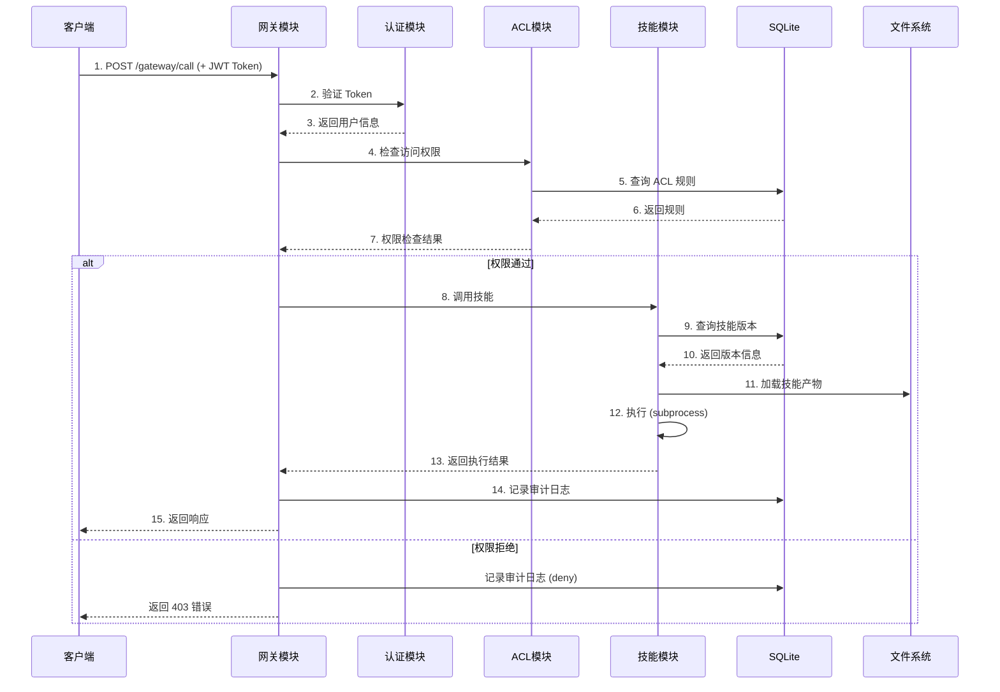
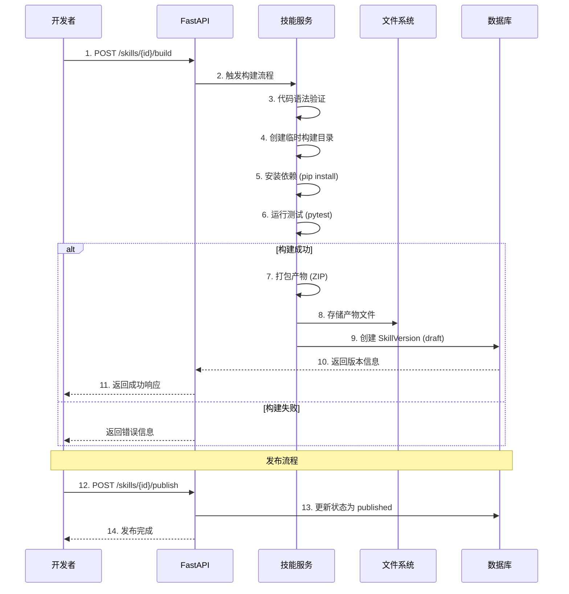

# SkillHub 系统架构设计 (MVP)

## 1. 概述

SkillHub 是一个企业级内部技能生态系统平台，旨在统一管理、发布和调用内部技能（Skills）。本文档描述 **MVP 阶段的简化架构**，专注于核心功能的最小可行实现。

### MVP 设计原则

- **单体优先**：单一 Python 服务，简化开发和部署
- **功能完整**：覆盖 PRD Phase 1 所有核心功能
- **简单可靠**：使用 SQLite 本地数据库，本地文件存储
- **快速迭代**：单进程开发模式，热重载支持
- **可演进**：清晰的模块划分，便于未来微服务化

---

## 2. 系统架构图 (MVP)



---

## 3. 核心组件说明 (MVP)

### 3.1 FastAPI 单体服务

**职责**：
- 统一的 HTTP 服务入口
- 所有 API 端点的路由处理
- 内部模块协调

**技术选型**：
- `FastAPI` - 现代异步 Web 框架
- `Uvicorn` - ASGI 服务器
- `Pydantic` - 数据验证

**端口配置**：
- 开发模式：`http://localhost:8000`
- API 文档：`http://localhost:8000/docs` (自动生成)

### 3.2 认证模块 (Auth Module)

**职责**：
- 用户注册和登录
- JWT Token 生成和验证
- 密码哈希和验证
- 刷新令牌管理

**数据模型**：
- `users` - 用户表
- `refresh_tokens` - 刷新令牌表

**技术实现**：
- `python-jose` - JWT 处理
- `passlib` + `bcrypt` - 密码哈希

**Token 有效期**：
- Access Token: 15 分钟
- Refresh Token: 7 天

### 3.3 RBAC 权限模块 (RBAC Module)

**职责**：
- 用户-角色-权限管理
- 角色分配和权限配置
- 权限检查逻辑

**数据模型**：
- `roles` - 角色表
- `permissions` - 权限表
- `user_roles` - 用户角色关联
- `role_permissions` - 角色权限关联

**预定义角色**：
| 角色 | 描述 | 权限范围 |
|------|------|----------|
| `super_admin` | 超级管理员 | 所有资源的完全控制 |
| `admin` | 系统管理员 | 用户管理、技能管理、配置管理 |
| `developer` | 开发者 | 技能构建、发布、测试 |
| `operator` | 运营人员 | 技能调用、日志查看 |
| `viewer` | 只读用户 | 仅查看权限 |

### 3.4 技能模块 (Skill Module)

**职责**：
- 技能代码上传和验证
- 构建流程管理
- 技能发布和版本控制
- 技能执行（subprocess）

**数据模型**：
- `skills` - 技能元数据
- `skill_versions` - 版本记录

**构建流程**：
```
代码上传 → 语法验证 → 依赖安装 → 测试验证 → 打包存储 → 创建版本记录
```

**执行方式**：
- Python 子进程隔离执行
- 超时控制
- 输出捕获

### 3.5 访问控制模块 (ACL Module)

**职责**：
- ACL 规则管理
- 访问权限检查（Any/RBAC 模式）
- 条件约束执行（限流、IP 白名单）
- 审计日志记录

**数据模型**：
- `acl_rules` - ACL 规则
- `acl_rule_roles` - RBAC 角色映射
- `audit_logs` - 审计日志

**访问模式**：
- `any` - 公开访问（带条件约束）
- `rbac` - 基于角色的访问控制

**条件支持**：
- `rateLimit` - 请求频率限制
- `ipWhitelist` - IP 白名单

### 3.6 网关模块 (Gateway Module)

**职责**：
- 统一的技能调用入口
- 请求路由和分发
- 响应格式标准化

**端点**：
- `POST /api/v1/gateway/call` - 统一调用接口

---

## 4. 项目结构

```
skillhub/
├── backend/
│   ├── main.py                 # FastAPI 应用入口
│   ├── config.py               # 配置管理
│   ├── database.py             # SQLAlchemy 数据库设置
│   │
│   ├── models/                 # SQLAlchemy ORM 模型
│   │   ├── __init__.py
│   │   ├── user.py             # User, Role, Permission
│   │   ├── skill.py            # Skill, SkillVersion
│   │   └── acl.py              # ACLRule, AuditLog
│   │
│   ├── schemas/                # Pydantic 验证模型
│   │   ├── __init__.py
│   │   ├── auth.py             # 登录、令牌相关
│   │   ├── skill.py            # 技能相关
│   │   └── acl.py              # ACL 相关
│   │
│   ├── api/                    # API 路由处理器
│   │   ├── __init__.py
│   │   ├── auth.py             # /auth/* 端点
│   │   ├── users.py            # /users/* 端点
│   │   ├── roles.py            # /roles/* 端点
│   │   ├── skills.py           # /skills/* 端点
│   │   ├── acl.py              # /acl/* 端点
│   │   └── gateway.py          # /gateway/* 端点
│   │
│   ├── services/               # 业务逻辑层
│   │   ├── __init__.py
│   │   ├── auth_service.py     # 认证服务
│   │   ├── rbac_service.py     # 权限服务
│   │   ├── skill_service.py    # 技能服务
│   │   ├── acl_service.py      # ACL 服务
│   │   └── gateway_service.py  # 网关服务
│   │
│   ├── skills/                 # 内置技能示例
│   ├── artifacts/              # 技能构建产物存储
│   ├── tests/                  # 测试文件
│   │
│   └── requirements.txt
│
├── frontend/
│   ├── src/
│   │   ├── pages/              # 页面组件
│   │   │   ├── Login.tsx
│   │   │   ├── Dashboard.tsx
│   │   │   ├── Skills.tsx
│   │   │   ├── SkillDetail.tsx
│   │   │   ├── Users.tsx
│   │   │   ├── Roles.tsx
│   │   │   └── ACL.tsx
│   │   │
│   │   ├── components/         # 可复用组件
│   │   │   ├── Layout.tsx
│   │   │   ├── SkillCard.tsx
│   │   │   ├── ACLForm.tsx
│   │   │   └── UserTable.tsx
│   │   │
│   │   ├── api/                # API 客户端
│   │   │   └── client.ts
│   │   │
│   │   ├── types/              # TypeScript 类型
│   │   │   └── index.ts
│   │   │
│   │   ├── App.tsx
│   │   └── main.tsx
│   │
│   ├── package.json
│   ├── vite.config.ts
│   └── tailwind.config.js
│
├── data/                       # 数据目录（运行时创建）
│   └── skillhub.db             # SQLite 数据库文件
│
├── docs/                       # 文档目录
│   ├── plans/
│   │   └── 2025-02-28-mvp-design.md
│   └── ...
│
├── run.py                      # 单命令启动脚本
├── README.md
└── .gitignore
```

---

## 5. 数据流图

### 5.1 技能调用流程



### 5.2 技能构建和发布流程



---

## 6. 部署架构 (MVP)

### 6.1 开发环境

```
┌─────────────────────────────────────────────────────────────┐
│                     开发机器                                 │
│                                                              │
│  ┌──────────────────┐      ┌──────────────────┐            │
│  │  Terminal 1      │      │  Terminal 2      │            │
│  │  ┌────────────┐  │      │  ┌────────────┐  │            │
│  │  │ FastAPI    │  │      │  │ Vite Dev   │  │            │
│  │  │ Uvicorn    │  │      │  │ Server     │  │            │
│  │  │ Port: 8000 │  │      │  │ Port: 5173 │  │            │
│  │  └────────────┘  │      │  └────────────┘  │            │
│  └──────────────────┘      └──────────────────┘            │
│           │                          │                      │
│           └──────────┬───────────────┘                      │
│                      ▼                                       │
│              ┌──────────────┐                                │
│              │ SQLite DB    │                                │
│              │ skillhub.db  │                                │
│              └──────────────┘                                │
└─────────────────────────────────────────────────────────────┘
```

### 6.2 单进程启动

使用 `run.py` 统一启动：

```python
# run.py 同时启动前端和后端
import subprocess
import sys

backend = subprocess.Popen([sys.executable, "-m", "uvicorn", "backend.main:app", "--reload"])
frontend = subprocess.Popen(["npm", "run", "dev"], cwd="frontend")

# 等待进程
backend.wait()
frontend.terminate()
```

**使用方式**：
```bash
python run.py    # 同时启动前后端
```

### 6.3 生产部署 (Docker Compose)

```yaml
# docker-compose.yml
version: '3.8'
services:
  skillhub:
    build: .
    ports:
      - "8000:8000"
    volumes:
      - ./data:/app/data
      - ./backend/artifacts:/app/backend/artifacts
    environment:
      - DATABASE_URL=sqlite:///data/skillhub.db
      - JWT_SECRET_KEY=${JWT_SECRET_KEY}
```

---

## 7. 技术选型 (MVP)

### 后端技术栈

| 技术 | 版本 | 用途 |
|------|------|------|
| Python | 3.11+ | 运行时 |
| FastAPI | 0.110+ | Web 框架 |
| Uvicorn | 0.27+ | ASGI 服务器 |
| SQLAlchemy | 2.0+ | ORM |
| Pydantic | 2.0+ | 数据验证 |
| python-jose | 3.3+ | JWT 处理 |
| passlib | 1.7+ | 密码哈希 |
| pytest | 8.0+ | 测试框架 |

### 前端技术栈

| 技术 | 版本 | 用途 |
|------|------|------|
| React | 18.x | UI 框架 |
| TypeScript | 5.x | 类型系统 |
| Vite | 5.x | 构建工具 |
| Tailwind CSS | 3.x | CSS 框架 |
| React Router | 6.x | 路由 |
| Axios | 1.x | HTTP 客户端 |
| React Query | 5.x | 数据获取 |
| Zustand | 4.x | 状态管理 |

### 数据存储

| 技术 | 用途 |
|------|------|
| SQLite 3.40+ | 主数据库 (单文件) |
| 本地文件系统 | 技能产物存储 |

---

## 8. 非功能性需求 (MVP)

### 8.1 性能目标

| 指标 | MVP 目标 | 未来目标 |
|------|----------|----------|
| API 响应时间 (P99) | < 500ms | < 200ms |
| 技能调用吞吐量 | > 100 QPS | > 10,000 QPS |
| 系统可用性 | 95% (dev) | 99.9% (prod) |

### 8.2 安全措施

- JWT Token 认证
- bcrypt 密码哈希
- ACL 访问控制
- 审计日志记录
- CORS 配置

### 8.3 可观测性

- 结构化日志 (Python `logging`)
- FastAPI 自动生成 OpenAPI 文档
- 审计日志查询 API

---

## 9. 未来演进路径

当 MVP 验证成功后，可按以下路径演进：

### Phase 2: 数据库升级
- 迁移到 PostgreSQL
- 添加 Redis 缓存
- 添加对象存储 (MinIO/S3)

### Phase 3: 服务拆分
- 拆分认证服务
- 拆分技能服务
- 拆分 ACL 服务

### Phase 4: 高级特性
- 集成 Dify 平台
- 支持第三方 API URL
- 高级 ACL 条件
- 多运行时支持 (Node.js, Go)

### Phase 5: 生产级部署
- Kubernetes 部署
- 服务网格 (Istio)
- 监控系统 (Prometheus + Grafana)
- 分布式追踪 (Jaeger)

---

## 10. MVP 限制说明

以下功能 **不在 MVP 范围内**：

| 功能 | MVP 状态 | 计划阶段 |
|------|----------|----------|
| Dify 平台集成 | ❌ 不包含 | Phase 2+ |
| 第三方 API URL 资源 | ❌ 不包含 | Phase 3+ |
| 多运行时支持 (Node.js, Go) | ❌ 不包含 | Phase 4+ |
| 灰度发布/蓝绿部署 | ❌ 不包含 | Phase 3+ |
| 高级 ACL 条件 (时间窗口) | ❌ 不包含 | Phase 2+ |
| 消息队列 | ❌ 不包含 | Phase 2+ |
| 高可用部署 | ❌ 不包含 | Phase 4+ |

---

**文档版本**: v2.0 (MVP)
**最后更新**: 2025-02-28
