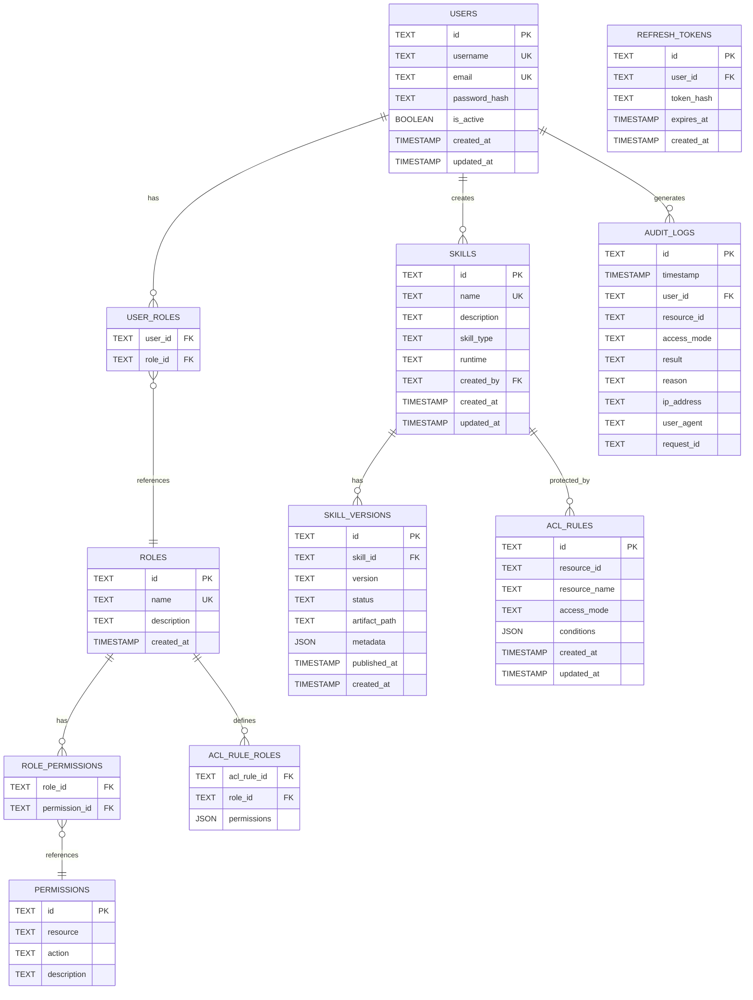

# SkillHub 数据模型设计 (MVP)

## 1. 概述

本文档定义 SkillHub MVP 的数据模型，使用 SQLite 作为数据库。数据模型经过简化，专注于 MVP 核心功能。

### MVP 数据库技术栈

| 技术 | 版本 | 说明 |
|------|------|------|
| SQLite | 3.40+ | 轻量级关系数据库，单文件存储 |
| SQLAlchemy | 2.0+ | Python ORM |
| Alembic | 1.12+ | 数据库迁移工具 |

---

## 2. 实体关系图



---

## 3. 核心表结构

### 3.1 用户和认证表

#### users（用户表）

```sql
CREATE TABLE users (
    id TEXT PRIMARY KEY,                       -- UUID
    username TEXT UNIQUE NOT NULL,
    email TEXT UNIQUE NOT NULL,
    password_hash TEXT NOT NULL,              -- bcrypt hash
    is_active BOOLEAN DEFAULT 1,              -- 1=active, 0=inactive
    created_at TIMESTAMP DEFAULT CURRENT_TIMESTAMP,
    updated_at TIMESTAMP DEFAULT CURRENT_TIMESTAMP
);

CREATE INDEX idx_users_username ON users(username);
CREATE INDEX idx_users_email ON users(email);
CREATE INDEX idx_users_is_active ON users(is_active);
```

#### refresh_tokens（刷新令牌表）

```sql
CREATE TABLE refresh_tokens (
    id TEXT PRIMARY KEY,                       -- UUID
    user_id TEXT NOT NULL,
    token_hash TEXT NOT NULL,                  -- Hashed token
    expires_at TIMESTAMP NOT NULL,
    created_at TIMESTAMP DEFAULT CURRENT_TIMESTAMP,
    FOREIGN KEY (user_id) REFERENCES users(id) ON DELETE CASCADE
);

CREATE INDEX idx_refresh_tokens_user_id ON refresh_tokens(user_id);
CREATE INDEX idx_refresh_tokens_expires_at ON refresh_tokens(expires_at);
```

### 3.2 角色和权限表

#### roles（角色表）

```sql
CREATE TABLE roles (
    id TEXT PRIMARY KEY,                       -- UUID
    name TEXT UNIQUE NOT NULL,
    description TEXT,
    created_at TIMESTAMP DEFAULT CURRENT_TIMESTAMP
);

-- 预置角色
INSERT INTO roles (id, name, description) VALUES
    ('role-super-admin', 'super_admin', '超级管理员，拥有所有权限'),
    ('role-admin', 'admin', '系统管理员'),
    ('role-developer', 'developer', '开发者，可以构建和发布技能'),
    ('role-operator', 'operator', '运营人员，可以调用技能'),
    ('role-viewer', 'viewer', '只读用户');
```

#### permissions（权限表）

```sql
CREATE TABLE permissions (
    id TEXT PRIMARY KEY,                       -- UUID
    resource TEXT NOT NULL,                    -- e.g., 'skills', 'users', 'acl'
    action TEXT NOT NULL,                      -- e.g., 'read', 'write', 'delete', 'execute'
    description TEXT,
    UNIQUE(resource, action)
);

CREATE INDEX idx_permissions_resource ON permissions(resource);
```

#### user_roles（用户角色关联表）

```sql
CREATE TABLE user_roles (
    user_id TEXT NOT NULL,
    role_id TEXT NOT NULL,
    PRIMARY KEY (user_id, role_id),
    FOREIGN KEY (user_id) REFERENCES users(id) ON DELETE CASCADE,
    FOREIGN KEY (role_id) REFERENCES roles(id) ON DELETE CASCADE
);

CREATE INDEX idx_user_roles_user_id ON user_roles(user_id);
CREATE INDEX idx_user_roles_role_id ON user_roles(role_id);
```

#### role_permissions（角色权限关联表）

```sql
CREATE TABLE role_permissions (
    role_id TEXT NOT NULL,
    permission_id TEXT NOT NULL,
    PRIMARY KEY (role_id, permission_id),
    FOREIGN KEY (role_id) REFERENCES roles(id) ON DELETE CASCADE,
    FOREIGN KEY (permission_id) REFERENCES permissions(id) ON DELETE CASCADE
);

CREATE INDEX idx_role_permissions_role_id ON role_permissions(role_id);
```

### 3.3 技能相关表

#### skills（技能表）

```sql
CREATE TABLE skills (
    id TEXT PRIMARY KEY,                       -- UUID
    name TEXT UNIQUE NOT NULL,
    description TEXT,
    skill_type TEXT NOT NULL,                  -- 'business_logic', 'api_proxy', 'ai_llm', 'data_processing'
    runtime TEXT NOT NULL DEFAULT 'python',    -- MVP: 仅支持 'python'
    created_by TEXT NOT NULL,
    created_at TIMESTAMP DEFAULT CURRENT_TIMESTAMP,
    updated_at TIMESTAMP DEFAULT CURRENT_TIMESTAMP,
    FOREIGN KEY (created_by) REFERENCES users(id)
);

CREATE INDEX idx_skills_name ON skills(name);
CREATE INDEX idx_skills_type ON skills(skill_type);
CREATE INDEX idx_skills_created_by ON skills(created_by);
```

#### skill_versions（技能版本表）

```sql
CREATE TABLE skill_versions (
    id TEXT PRIMARY KEY,                       -- UUID
    skill_id TEXT NOT NULL,
    version TEXT NOT NULL,                     -- Semantic version '1.0.0'
    status TEXT NOT NULL DEFAULT 'draft',     -- 'draft', 'published', 'deprecated'
    artifact_path TEXT,                       -- 本地文件路径
    metadata TEXT,                            -- JSON: input_schema, output_schema, config
    published_at TIMESTAMP,
    created_at TIMESTAMP DEFAULT CURRENT_TIMESTAMP,
    UNIQUE(skill_id, version),
    FOREIGN KEY (skill_id) REFERENCES skills(id) ON DELETE CASCADE
);

CREATE INDEX idx_skill_versions_skill_id ON skill_versions(skill_id);
CREATE INDEX idx_skill_versions_status ON skill_versions(status);
CREATE INDEX idx_skill_versions_version ON skill_versions(skill_id, version DESC);
```

### 3.4 ACL 相关表

#### acl_rules（ACL 规则表）

```sql
CREATE TABLE acl_rules (
    id TEXT PRIMARY KEY,                       -- UUID
    resource_id TEXT NOT NULL,                -- 技能 ID 或资源标识符
    resource_name TEXT NOT NULL,
    access_mode TEXT NOT NULL,                -- 'any' or 'rbac'
    conditions TEXT,                          -- JSON: rateLimit, ipWhitelist, etc.
    created_at TIMESTAMP DEFAULT CURRENT_TIMESTAMP,
    updated_at TIMESTAMP DEFAULT CURRENT_TIMESTAMP
);

CREATE INDEX idx_acl_rules_resource_id ON acl_rules(resource_id);
CREATE INDEX idx_acl_rules_access_mode ON acl_rules(access_mode);
```

#### acl_rule_roles（ACL 规则角色关联表）

```sql
CREATE TABLE acl_rule_roles (
    acl_rule_id TEXT NOT NULL,
    role_id TEXT NOT NULL,
    permissions TEXT NOT NULL,                -- JSON array: ['read', 'execute']
    PRIMARY KEY (acl_rule_id, role_id),
    FOREIGN KEY (acl_rule_id) REFERENCES acl_rules(id) ON DELETE CASCADE,
    FOREIGN KEY (role_id) REFERENCES roles(id) ON DELETE CASCADE
);

CREATE INDEX idx_acl_rule_roles_acl_rule_id ON acl_rule_roles(acl_rule_id);
CREATE INDEX idx_acl_rule_roles_role_id ON acl_rule_roles(role_id);
```

### 3.5 审计日志表

#### audit_logs（审计日志表）

```sql
CREATE TABLE audit_logs (
    id TEXT PRIMARY KEY,                       -- UUID
    timestamp TIMESTAMP DEFAULT CURRENT_TIMESTAMP,
    user_id TEXT,                             -- 可为 NULL（未认证请求）
    resource_id TEXT NOT NULL,
    access_mode TEXT NOT NULL,                -- 'any' or 'rbac'
    result TEXT NOT NULL,                     -- 'allow' or 'deny'
    reason TEXT,
    ip_address TEXT,
    user_agent TEXT,
    request_id TEXT,
    FOREIGN KEY (user_id) REFERENCES users(id) ON DELETE SET NULL
);

CREATE INDEX idx_audit_logs_timestamp ON audit_logs(timestamp DESC);
CREATE INDEX idx_audit_logs_user_id ON audit_logs(user_id);
CREATE INDEX idx_audit_logs_resource_id ON audit_logs(resource_id);
CREATE INDEX idx_audit_logs_result ON audit_logs(result);
```

---

## 4. 数据库初始化

### 4.1 SQLAlchemy 模型定义

```python
# backend/models/__init__.py
from sqlalchemy import create_engine, Column, String, Boolean, DateTime, Text, ForeignKey, JSON
from sqlalchemy.ext.declarative import declarative_base
from sqlalchemy.orm import relationship
from datetime import datetime

Base = declarative_base()

class User(Base):
    __tablename__ = "users"

    id = Column(String, primary_key=True)
    username = Column(String, unique=True, nullable=False)
    email = Column(String, unique=True, nullable=False)
    password_hash = Column(String, nullable=False)
    is_active = Column(Boolean, default=True)
    created_at = Column(DateTime, default=datetime.utcnow)
    updated_at = Column(DateTime, default=datetime.utcnow, onupdate=datetime.utcnow)

class Role(Base):
    __tablename__ = "roles"

    id = Column(String, primary_key=True)
    name = Column(String, unique=True, nullable=False)
    description = Column(Text)
    created_at = Column(DateTime, default=datetime.utcnow)

class Permission(Base):
    __tablename__ = "permissions"

    id = Column(String, primary_key=True)
    resource = Column(String, nullable=False)
    action = Column(String, nullable=False)
    description = Column(Text)

class Skill(Base):
    __tablename__ = "skills"

    id = Column(String, primary_key=True)
    name = Column(String, unique=True, nullable=False)
    description = Column(Text)
    skill_type = Column(String, nullable=False)
    runtime = Column(String, nullable=False, default="python")
    created_by = Column(String, ForeignKey("users.id"))
    created_at = Column(DateTime, default=datetime.utcnow)
    updated_at = Column(DateTime, default=datetime.utcnow, onupdate=datetime.utcnow)

class SkillVersion(Base):
    __tablename__ = "skill_versions"

    id = Column(String, primary_key=True)
    skill_id = Column(String, ForeignKey("skills.id", ondelete="CASCADE"))
    version = Column(String, nullable=False)
    status = Column(String, nullable=False, default="draft")
    artifact_path = Column(String)
    metadata = Column(JSON)
    published_at = Column(DateTime)
    created_at = Column(DateTime, default=datetime.utcnow)

class ACLRule(Base):
    __tablename__ = "acl_rules"

    id = Column(String, primary_key=True)
    resource_id = Column(String, nullable=False)
    resource_name = Column(String, nullable=False)
    access_mode = Column(String, nullable=False)  # 'any' or 'rbac'
    conditions = Column(JSON)
    created_at = Column(DateTime, default=datetime.utcnow)
    updated_at = Column(DateTime, default=datetime.utcnow, onupdate=datetime.utcnow)

class AuditLog(Base):
    __tablename__ = "audit_logs"

    id = Column(String, primary_key=True)
    timestamp = Column(DateTime, default=datetime.utcnow)
    user_id = Column(String, ForeignKey("users.id", ondelete="SET NULL"))
    resource_id = Column(String, nullable=False)
    access_mode = Column(String, nullable=False)
    result = Column(String, nullable=False)  # 'allow' or 'deny'
    reason = Column(Text)
    ip_address = Column(String)
    user_agent = Column(String)
    request_id = Column(String)

class RefreshToken(Base):
    __tablename__ = "refresh_tokens"

    id = Column(String, primary_key=True)
    user_id = Column(String, ForeignKey("users.id", ondelete="CASCADE"))
    token_hash = Column(String, nullable=False)
    expires_at = Column(DateTime, nullable=False)
    created_at = Column(DateTime, default=datetime.utcnow)
```

### 4.2 初始化脚本

```python
# backend/init_db.py
from backend.models import Base, User, Role, Permission
from backend.database import engine
import uuid

def init_db():
    # 创建所有表
    Base.metadata.create_all(bind=engine)

    # 创建预置角色
    roles = [
        Role(id=str(uuid.uuid4()), name="super_admin", description="超级管理员"),
        Role(id=str(uuid.uuid4()), name="admin", description="系统管理员"),
        Role(id=str(uuid.uuid4()), name="developer", description="开发者"),
        Role(id=str(uuid.uuid4()), name="operator", description="运营人员"),
        Role(id=str(uuid.uuid4()), name="viewer", description="只读用户"),
    ]

    # 创建预置权限
    permissions = [
        Permission(id=str(uuid.uuid4()), resource="skills", action="create"),
        Permission(id=str(uuid.uuid4()), resource="skills", action="read"),
        Permission(id=str(uuid.uuid4()), resource="skills", action="write"),
        Permission(id=str(uuid.uuid4()), resource="skills", action="delete"),
        Permission(id=str(uuid.uuid4()), resource="skills", action="execute"),
        Permission(id=str(uuid.uuid4()), resource="users", action="read"),
        Permission(id=str(uuid.uuid4()), resource="users", action="create"),
        Permission(id=str(uuid.uuid4()), resource="users", action="write"),
        Permission(id=str(uuid.uuid4()), resource="users", action="delete"),
        Permission(id=str(uuid.uuid4()), resource="acl", action="read"),
        Permission(id=str(uuid.uuid4()), resource="acl", action="create"),
        Permission(id=str(uuid.uuid4()), resource="acl", action="write"),
        Permission(id=str(uuid.uuid4()), resource="acl", action="delete"),
    ]

    from sqlalchemy.orm import Session
    session = Session(bind=engine)

    try:
        # 检查是否已初始化
        if session.query(Role).count() == 0:
            session.add_all(roles)
            session.add_all(permissions)
            session.commit()
            print("Database initialized successfully!")
        else:
            print("Database already initialized.")
    except Exception as e:
        session.rollback()
        print(f"Error initializing database: {e}")
    finally:
        session.close()

if __name__ == "__main__":
    init_db()
```

---

## 5. 数据迁移

### 5.1 Alembic 配置

```ini
# alembic.ini
[alembic]
script_location = backend/migrations
file_template = %%(year)d%%(month).2d%%(day).2d_%%(hour).2d%%(minute).2d_%%(rev)s_%%(slug)s
sqlalchemy.url = sqlite:///data/skillhub.db

[loggers]
keys = root,sqlalchemy,alembic

[handlers]
keys = console

[formatters]
keys = generic

[logger_root]
level = WARN
handlers = console
qualname =

[logger_sqlalchemy]
level = WARN
handlers =
qualname = sqlalchemy.engine

[logger_alembic]
level = INFO
handlers =
qualname = alembic

[handler_console]
class = StreamHandler
args = (sys.stderr,)
level = NOTSET
formatter = generic

[formatter_generic]
format = %(levelname)-5.5s [%(name)s] %(message)s
datefmt = %H:%M:%S
```

### 5.2 创建迁移

```bash
# 创建迁移
alembic revision --autogenerate -m "Initial migration"

# 执行迁移
alembic upgrade head

# 回滚迁移
alembic downgrade -1
```

---

## 6. 数据字典

### 6.1 枚举值定义

#### 技能类型 (skill_type)

| 值 | 描述 |
|----|------|
| business_logic | 业务逻辑函数 |
| api_proxy | API 代理 |
| ai_llm | AI/LLM 能力 |
| data_processing | 数据处理 |

#### 版本状态 (version_status)

| 值 | 描述 |
|----|------|
| draft | 草稿 |
| published | 已发布 |
| deprecated | 已废弃 |

#### 访问模式 (access_mode)

| 值 | 描述 |
|----|------|
| any | 公开访问（带条件约束） |
| rbac | 基于角色的访问控制 |

#### 审计结果 (audit_result)

| 值 | 描述 |
|----|------|
| allow | 允许访问 |
| deny | 拒绝访问 |

### 6.2 JSON 字段格式

#### skill_versions.metadata

```json
{
  "input_schema": {
    "type": "object",
    "properties": {
      "city": {"type": "string"},
      "days": {"type": "integer", "minimum": 1, "maximum": 7}
    },
    "required": ["city"]
  },
  "output_schema": {
    "type": "object",
    "properties": {
      "forecast": {"type": "array"}
    }
  },
  "config": {
    "timeout": 30,
    "memory": 256
  }
}
```

#### acl_rules.conditions

```json
{
  "rateLimit": "100/minute",
  "ipWhitelist": ["10.0.0.0/8", "192.168.0.0/16"]
}
```

#### acl_rule_roles.permissions

```json
["read", "execute", "write", "delete"]
```

---

## 7. 数据备份和恢复

### 7.1 备份

```bash
# 备份 SQLite 数据库
cp data/skillhub.db data/backups/skillhub_$(date +%Y%m%d_%H%M%S).db
```

### 7.2 恢复

```bash
# 恢复 SQLite 数据库
cp data/backups/skillhub_20250228_100000.db data/skillhub.db
```

---

**文档版本**: v2.0 (MVP)
**最后更新**: 2025-02-28
